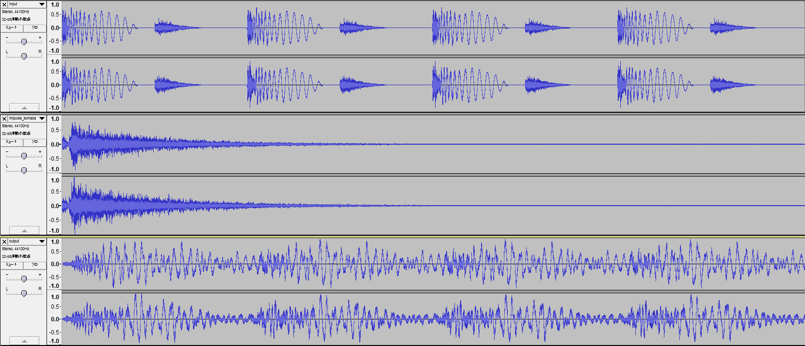

concert convolution effect
===========

指定されたwavファイルに畳み込みリバーブのエフェクトを付与します。音楽サークルのコンサートでの編曲時、録音環境とコンサート会場の環境でリバーブのかかり方が異なります。このため、録音環境でリバーブを調整すると本番でしばしばリバーブがかかりすぎになってしまいます。そこで録音データに本番環境を模したインパルス応答で畳み込むことでコンサート時のリバーブのかかり具合を確認するためのエフェクトを作りました。

上から順番に元のwav、インパルス、畳み込み後のwavです。

Convolutionプロジェクトは指定されたwavファイルにリバーブを付与します。ConvolutionGUIは左記のオプションをGUIで設定し本体にパイプするだけのWindowns Formsアプリケーションです。

fftにfftwを利用しています。インパルス応答はVoxengoの[Voxengo Impluse Modeler](http://www.voxengo.com/product/imodeler/)を利用して作成しました。
